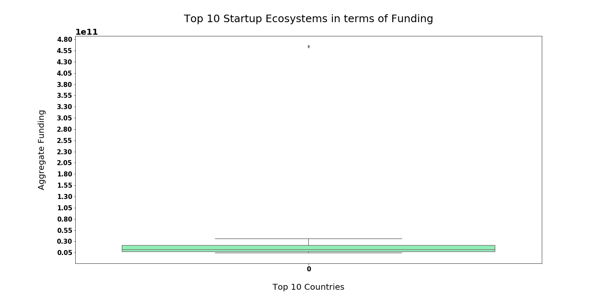
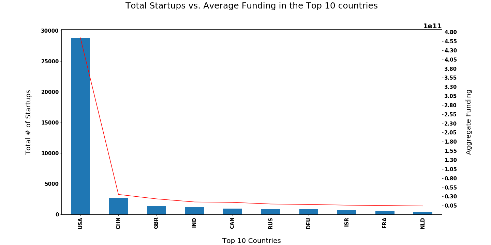
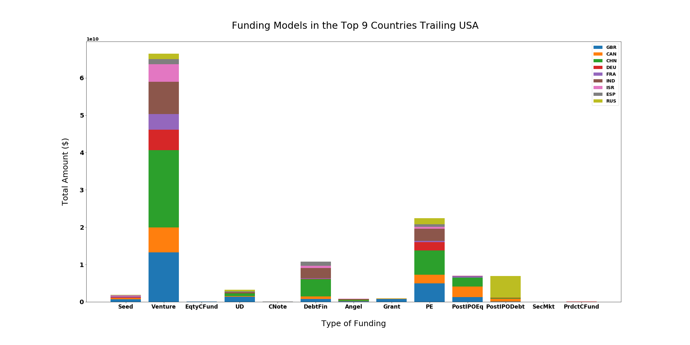
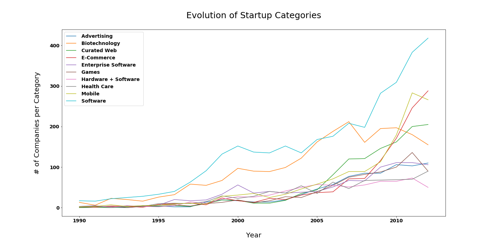

# Global Startup Ecosystem

### Main Objective
Analyze the evolution of the global startup scene from 1990 until 2020 based on number of startups, categories, and investment types

#### Problem Definition
In light of the global recession coupled with the sudden spread of the Covid-19 pandemic, a good friend of mine has unfortunately been forced to quit his job due to the economic and financial downturn his company was facing. As a result, he thought that it would only seem reasonable in such dire times to venture in a business startup. Unfortunately, my friend has no information on the global startup scene and has asked me to brief him on it so that he can go ahead and plan his next steps. My analysis will contain the following:

- Market analysis on the leading 10 countries in terms of total startups launched
- Market analysis on the leading 10 countries in terms of aggregate fundings for startups
- Market analysis on the capital structure of startups for the leading 10 countries (Investment Analysis)
- Trending startup categories
- A close-up on one of the categories expected to skyrocket (E-Learning) 

#### Tools Used
- Python
  - Libraries:
    - requests
    - json
    - bs4
    - pandas
    - numpy
    - re
    - time
    - datetime 
    - matplotlib
    - seaborn
    - selenium
    - pymysql
- Repl
- Spyder
- MySQL
- Selenium
- Trello

#### Resources
- Kaggle - Startup Investments (Crunchbase)
  - https://www.kaggle.com/arindam235/startup-investments-crunchbase#investments_VC.csv
- Startup Ranking Website
  - https://www.startupranking.com/

#### Process
- Data Acquisition
  - Kaggle Dataset: Startup Investments (Crunchbase)
  - Shape: 54294 rows, 39 columns 
- Web Scraping
  - https://www.startupranking.com/
- Data Cleaning
  - e.g. Uniformative or Repetitive Data, Duplicates, Null Values, Missing Data, Irregular Data (Outliers detection via plots or descriptive statistics), Inconsistent Data (e.g. Capitalization, Format)
- Analysis and Visualization
  - Descriptive and Predictive Analysis
  - Graphs 

#### Results

