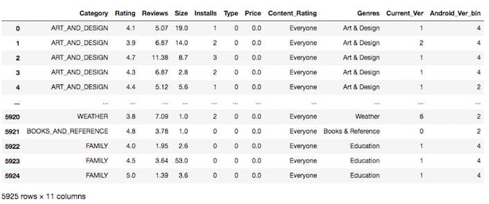
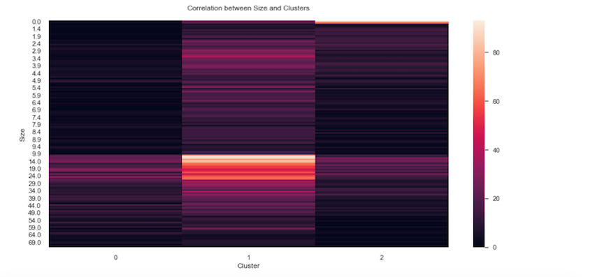
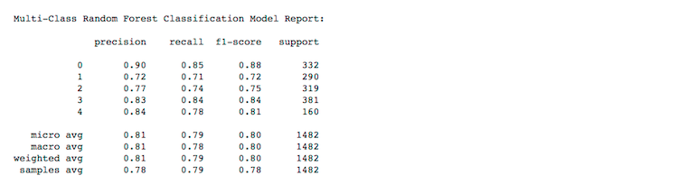

# Google Play Apps Installation Predictor

### Objective
The Google Play Store data has enormous potential to drive app-making businesses to success. Actionable insights can be drawn for developers to work on and capture a big share of the Android market. Accordingly, I will build a multi-variate classification model to predict the total installations per app based on a set of features.

#### Problem Definition
The dataset used in this project is retreived from Kaggle, consisting of more than 10K unique apps with 11 features fetched from Google's Play Store.The biggest challenge is to transform my intial dataset into an optimized one through proper feature scaling and engineering and choosing the right fit model with the highest predictive power based on the following classification metrics:
- Accuracy
- Precision (Positive Predictive Value)
- Recall (True Positive Rate)
- F1-Score (Weighted Harmonic Mean of Precision and Recall)
- AUC-ROC (True Positive Rate vs False Positive Rate)

#### Tools Used
- Python
  - Libraries:
    - pandas
    - numpy
    - matplotlib
    - seaborn
    - sklearn.feature_selection
    - sklearn.cluster
    - sklearn.decomposition
    - sklearn.metrics
    - kmodes.kmodes
    - warnings
- Spyder
- Trello

#### Resources
- Kaggle - Google Play Store Apps
  - https://www.kaggle.com/lava18/google-play-store-apps
- Google Play Store Website
  - https://play.google.com/store
  
#### Process
- Data Acquisition
  - Kaggle Dataset: Google Play Store Apps
  - Shape of datasets: 10,841 rows, 13 columns
 
 
 
- Data Cleaning
  - e.g. Data Type Correction, Uniformative or Repetitive Data, Duplicates, Null Values, Missing Data, Irregular Data (Outliers detection via plots & descriptive statistics)
  
  
  

- Data Transformation
  - Label Encoding - Ordinal Categorical Variable
  - Binning - Target Variable (5 Installation Brackets)
  - Grouping 
- Feature Scaling
  - Units transformation
  - Log Scaling
  
  

- Checking Assumption 
  - Multicollinearity for Logistic Regression Model
- Feature Engineering
  - Filter Based
    - F-Classification
  - PCA
    - Dimensionality Reduction
  - Clustering
    - Kmeans
    - Agglomerative 
    - Kmodes
  - Evaluation
    - Silhoutte
    - Davies-Bouldin
    
   

   
   
   
   
   
   
   
   

    
- Modeling
  - Multivariate Logistic Regression
  - Multivariate Random Forest
- Analysis and Visualization
  - Descriptive and Predictive Analysis
  - Graphs 
    
   
   
   
   

