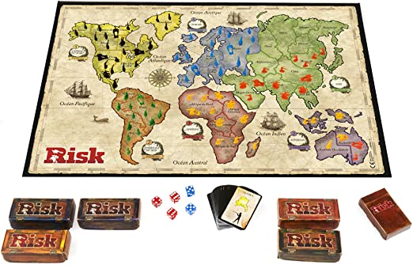

# Risk Game

### Objective
Re-creating Risk Board Game using Python

#### Rules
Objective mission:
- Conquer the world
Continents: 6 
- Australia, South America, Africa, North America, Europe, and Asia 
- Territories: India, China, Cyberia, Canada, United States, Mexico, Brazil, Peru, Argentina, Western Europe, Eastern Europe, Northern Europe, Northern Africa, Western Africa, Southern Africa, Australia, New Zealand, Indonesia

Armies
- Only infantry (worth 1) 
- 2 players for now, with 20 armies each

Cards
- Cards with territory only

Set Up
- Roll die, the highest gets to place the 1st infantry on any territory 
- Continue placing armies on land territories until no more infantry
- The highest dice player goes first

Game Play
- Getting and placing new armies
- Either Attacking or Fortifying your position

Receiving Infantry
- Territories: # of territories you occupy / 3, rounded down (Skip first turn, and start from the second)
  - Asia: 7
  - North America: 5
  - Europe: 5
  - Africa: 3
  - South America: 2
  - Australia: 2

Risk Cards
- After capturing a territory, you earn 1 risk card
- Trade 5 cards with 1 Infantry only)
- After 6th set has been traded in, each additional set is worth 5 armies
- If any of the 3 cards you trade in shows the picture of a territory you occupy, you get 2 additional cards

Attacking 
- Only attack territories that are adjacent or connected via a dash line
- At least 2 armies in the territory you are attacking from
- You may shift to attacking another territory at any time during your turn
- At least 1 more army in your territory than the number of dices you roll
- Defender will roll either 1 or 2 dice. To roll 2 dice, he must have at least 2 infantry in territory

To decide a battle
- One battle, either win or lose – Conquer or Die
- Compares highest dice each of you rolled
- Loser will lose one infantry

Fortifying 
- For each turn, you have the choice to pass or play your turn
 
