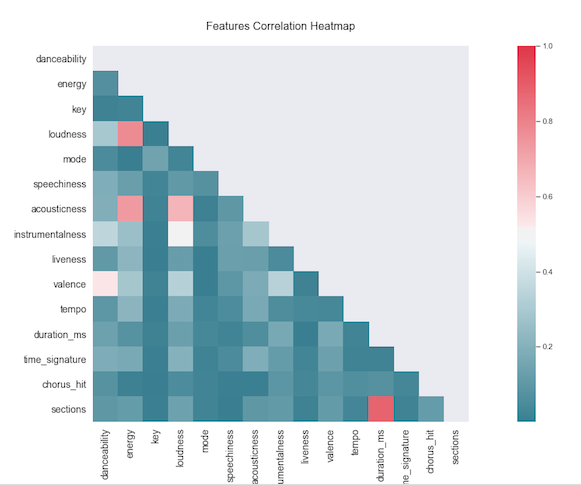
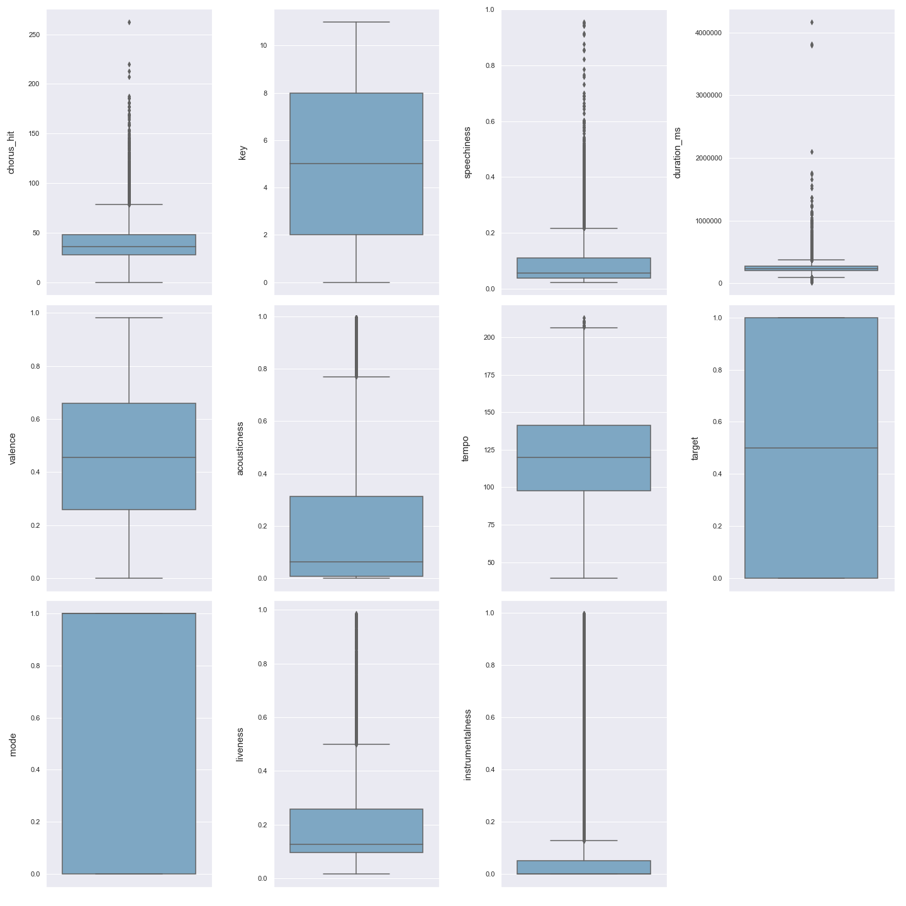
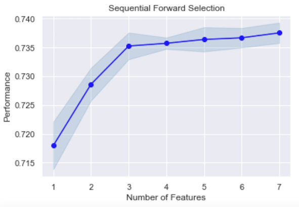
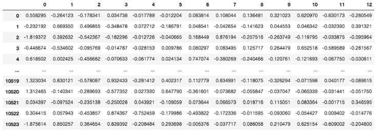
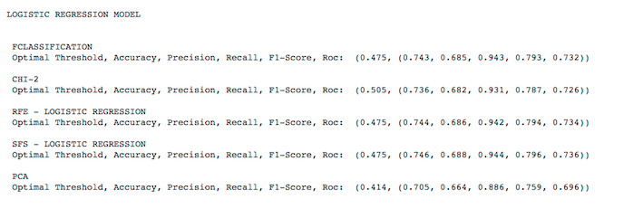
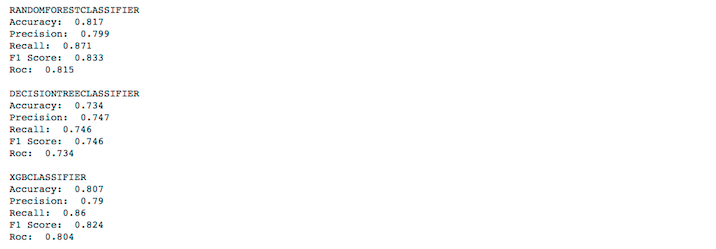

# Spotify Hit/Flop Predictor

### Objective
Develop an accurate Classification model that can predict whether a newly released song on Spotify could become a hit, i.e. a song that might be featured in the weekly billboard charts and potentially become popular in the mainstream.

#### Problem Definition
The dataset used in this project is retreived from Kaggle, consisting of more than 10K unique songs from 2000-2019 along with 15 features fetched from Spotify's Web API. The following link contains a detailed description of the features used to describe the songs in the dataset: https://developer.spotify.com/documentation/web-api/reference/tracks/get-audio-features/. The biggest challenge is to transform my intial dataset into an optimized one through proper feature scaling and engineering and choosing the right fit model that has the highest predictive power based on the following classification metrics:
- Accuracy
- Precision (Positive Predictive Value)
- Recall (True Positive Rate)
- F1-Score (Weighted Harmonic Mean of Precision and Recall)
- AUC-ROC (True Positive Rate vs False Positive Rate)

#### Tools Used
- Python
  - Libraries:
    - pandas
    - numpy
    - matplotlib
    - seaborn
    - mlxtend.plotting
    - statsmodels.stats.outliers_influence
    - sklearn.preprocessing
    - sklearn.feature_selection
    - mlxtend.feature_selection
    - sklearn.decomposition
    - sklearn.model_selection
    - sklearn.linear_model
    - sklearn.ensemble 
    - sklearn.tree
    - xgboost
    - sklearn.metrics
- Repl
- Spyder
- Trello

#### Resources
- Kaggle - The Spotify Hit Predictor Dataset (1960-2019)
  - https://www.kaggle.com/theoverman/the-spotify-hit-predictor-dataset#dataset-of-00s.csv
- Spotify for Developers Website
  - https://developer.spotify.com/
  
#### Process
- Data Acquisition
  - Kaggle Dataset: The Spotify Hit Predictor Dataset (1960-2019)
  - 2 csv files : 
    - Dataset for the 00s, starting from 1/1/2000 - 31/12/2009
    - Dataset for the 10s, starting from 1/1/2010 - 31/12/2019
  - Shape of combined datasets: 12,270 rows, 19 columns
- Data Cleaning
  - e.g. Uniformative or Repetitive Data, Duplicates, Null Values, Missing Data, Irregular Data (Outliers detection via plots or descriptive statistics)
- Checking Assumption 
  - e.g. Multicollinearity for Logistic Regression Model
- Feature Scaling
  - Units transformation
  - Normalization e.g.MinMaxScaler
- Feature Engineering
  - Filter Based
    - F-Classification
    - Chi-2
  - Wrappers
    - RFE (Logistic Regression)
    - SFS (Logistic Regression)
  - PCA
    - Dimensionality Reduction
- Modeling
  - Logistic Regression
  - Random Forest
  - Decision Tree Classifier
  - XGBoost
- Analysis and Visualization
  - Descriptive and Predictive Analysis
  - Graphs 

#### Results

